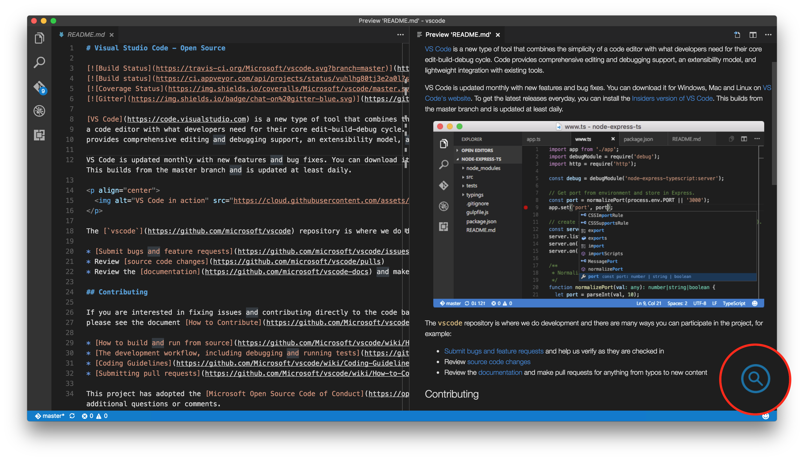

# "Find in Page" in Preview Editor README


> **This extension replaces the files included in vscode distribution** and **Please install every time vscode is updated.**

> **For windows only**: In order to execute `Install` or `UnInstall`, You only have to activate **vscode with administrator privileges** once.

## Features

Add a `"Find in Page"` button to the preview editor.



Click on the lens icon and Please enter keyword to search and press Enter key.


You can search documents such as **Help | Release note**, Markdown preview, [Git History (git log)](https://marketplace.visualstudio.com/items?itemName=donjayamanne.githistory) Extension's `Git: View History (git log)`  and more.


Release Notes:


Markdown Preview:


Git: View History:


## Installation

Launch VS Code Quick Open (Ctrl+P), paste the following command, and type enter.

```
ext install vscode-findinpage
```

## Usage

`Toggle "Find in Page" in Preview Editor` command

* **Install**: Enable the `"Find in Page"` button and Replace the file.
* **UnInstall**: Disable the `"Find in Page"` button and Restore the original file.

> **For windows only**: In order to execute `Install` or `UnInstall`, You only have to activate **vscode with administrator privileges** once.

```
Error: EPERM: operation not permitted, open 'C:\Program Files (x86)\Microsoft VS Code\resources\app\out\vs\workbench\parts\html\browser\webview-pre.js'
```

### Install


### How to update

- Install new version of extension
- Please execute `Uninstall`
- Please execute `Install` again

## How is it implemented?

Embeded minified find6.js on webview-pre.js.

* <https://github.com/Microsoft/vscode/blob/master/src/vs/workbench/parts/html/browser/webview-pre.js>

It is the function of the extension to replace this file.

About the details of "Cool Javascript Find on this Page":
* [Cool Javascript Find on this Page - Fixed Position Edition](http://www.seabreezecomputers.com/tips/find6.htm)

Thanks to the author of "Cool Javascript Find on this Page".


<!--## Extension Settings


```css
#cool_find_msg{
	color: black;
}
```-->


## Known Issues

* **Please Install every time vscode is updated.**
* I expect the vscode team's native implementation...(See, [Find is not available in Markdown Preview mode #2187](https://github.com/Microsoft/vscode/issues/2187)

## Change Log

### 0.0.3

- Change Appearance
- Change "Apply" to "Install"
- Change "Restore" to "UnInstall"

### 0.0.2

- Fix for Windows

### 0.0.1

- Initial release


## License

This extension is licensed under the MIT License.


**Enjoy!**